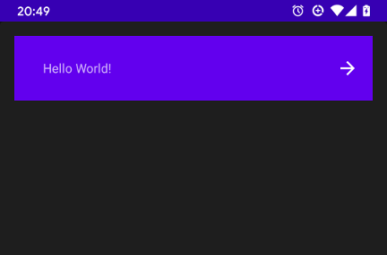
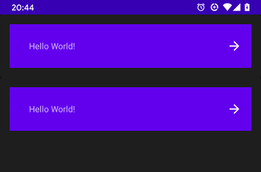

# AutomatedAccessibilityTest
A small sample app demonstrating how [automated accessibility](https://developer.android.com/guide/topics/ui/accessibility/testing#automated) checks can be performed as part of a
UI testing suite. Using a real example of a generic list item matching material design guidelines.

This uses `AccessibilityChecks.enable()` from the [espresso accessibility](https://github.com/google/Accessibility-Test-Framework-for-Android) package.
```
androidTestImplementation 'androidx.test.espresso:espresso-accessibility:3.2.0-alpha03'
``` 
* An alpha version had to be used to fix build errors [here](https://github.com/android/android-test/issues/376) and [here](https://github.com/android/android-test/issues/492)

The static function should be called before class initialisation in your test class. Which applies the additional requirements to all views that ui tests interact with as part of their normal execution. Automating the process of identifying layout problems which may otherwise have been missed.

```
class AccessibilityInstrumentedTest {
    companion object {
        @BeforeClass
        @JvmStatic
        fun enableAccessibilityChecks() {
            AccessibilityChecks.enable()
        }
    }
```

Once enabled you'll see new warnings for problems like small touch points for buttons or poor support for screen reader which make it harder for potential users to interact with your app. If you have these tests running as part of your CI setup you can fix the touch point size before that ever happens or the app reaches the qa team.

```
com.google.android.apps.common.testing.accessibility.framework.integrations.AccessibilityViewCheckException: There were 2 accessibility errors:
    View is missing speakable text needed for a screen reader,
    View falls below the minimum recommended size for touch targets. Minimum touch target size is 48x48dp. Actual size is 24.0x24.0dp (screen density is 2.0)
```


# Running the sample


The sample app UI uses a simple material card view which my appear once or many times as part of a recyclerview in your application. The image button has its size set based on the material design specifications. Which will pass and everything will seem great.

```
<com.google.android.material.card.MaterialCardView xmlns:android="http://schemas.android.com/apk/res/android"
    xmlns:app="http://schemas.android.com/apk/res-auto"
    xmlns:tools="http://schemas.android.com/tools"
    android:id="@+id/singleLineCardLayout"
    android:layout_width="match_parent"
    android:layout_height="match_parent">

    <androidx.constraintlayout.widget.ConstraintLayout
        android:id="@+id/itemLayout"
        android:layout_width="match_parent"
        android:layout_height="wrap_content"
        android:padding_end="16dp"
        android:background="@color/colorPrimary">

        <TextView
            android:id="@+id/cardTitle"
            android:layout_width="0dp"
            android:layout_height="wrap_content"
            android:text="@string/hello"
            app:layout_constraintEnd_toStartOf="@id/cardEndIcon"
            app:layout_constraintStart_toStartOf="parent"
            app:layout_constraintTop_toTopOf="parent" />

        <!-- match view size to spec  https://material.io/components/lists#specs -->
        <ImageButton
            android:id="@+id/cardEndIcon"
            android:layout_width="24dp"
            android:layout_height="24dp"
            android:src="@drawable/ic_arrow_forward"
            app:layout_constraintBottom_toBottomOf="parent"
            app:layout_constraintEnd_toEndOf="parent"
            app:layout_constraintTop_toTopOf="parent" />
    </androidx.constraintlayout.widget.ConstraintLayout>
</com.google.android.material.card.MaterialCardView>
```


In order to check the user is able to click the button and move through the app you may have a simple test like the one below. Which will pass and give you confidence the user flow works. With the accessibility checks enabled you'll be made aware that the size of the view makes it difficult to interact with.

The sample app includes two test suites one where accessibility checks enabled causing tests to fail and a passing test where the checks are not made. Be sure to run them individually as the setting is applied to all running tests.
```
    @Test
    fun buttonWithIdCanBeClicked() {
        onView(withId(R.id.helloButton)).perform(ViewActions.click())
    }
```

Example output:
```
com.google.android.apps.common.testing.accessibility.framework.integrations.AccessibilityViewCheckException: There were 2 accessibility errors:
AppCompatImageButton{id=2131230794, res-name=cardEndIcon, visibility=VISIBLE, width=48, height=48, has-focus=true, has-focusable=true, has-window-focus=false, is-clickable=true, is-enabled=true, is-focused=true, is-focusable=true, is-layout-requested=false, is-selected=false, layout-params=androidx.constraintlayout.widget.ConstraintLayout$LayoutParams@9bf33, tag=null, root-is-layout-requested=false, has-input-connection=false, x=576.0, y=48.0}: View is missing speakable text needed for a screen reader,
AppCompatImageButton{id=2131230794, res-name=cardEndIcon, visibility=VISIBLE, width=48, height=48, has-focus=true, has-focusable=true, has-window-focus=false, is-clickable=true, is-enabled=true, is-focused=true, is-focusable=true, is-layout-requested=false, is-selected=false, layout-params=androidx.constraintlayout.widget.ConstraintLayout$LayoutParams@9bf33, tag=null, root-is-layout-requested=false, has-input-connection=false, x=576.0, y=48.0}: View falls below the minimum recommended size for touch targets. Minimum touch target size is 48x48dp. Actual size is 24.0x24.0dp (screen density is 2.0)
```
The same app includes a updated layout to fix these errors without the appearance changing.


